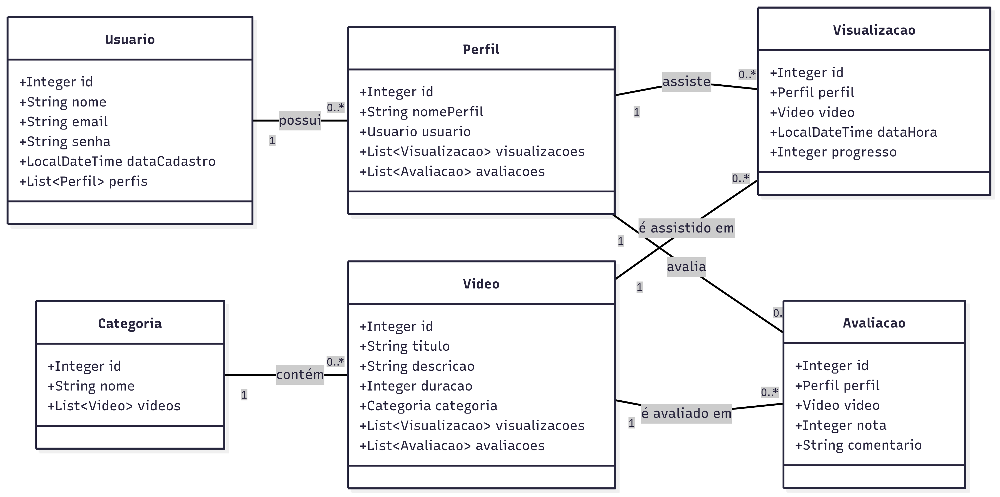

# Projeto de Streaming de Vídeos - Special Potato

Bem-vindo ao repositório do **Special Potato**, um sistema de streaming de vídeos desenvolvido como um projeto robusto utilizando Java, Spring Boot e Spring Data JPA. A aplicação implementa um modelo de domínio completo para gerenciar usuários, perfis, vídeos, categorias, visualizações e avaliações, com consultas complexas para análise de dados.

## Visão Geral do Projeto

O objetivo deste projeto é demonstrar a aplicação prática de conceitos de persistência de dados com JPA/Hibernate em um ambiente Spring Boot. A aplicação é capaz de:
- Mapear um modelo relacional de banco de dados para entidades Java.
- Realizar operações de CRUD (Create, Read, Update, Delete).
- Executar consultas complexas para obter insights, como os vídeos mais assistidos e mais bem avaliados.
- Inclui uma rotina para popular o banco de dados com dados de teste na primeira execução.

---

## 🚀 Como Executar o Projeto

Para executar este projeto, siga os passos abaixo. É crucial seguir a ordem para garantir que o banco de dados e a aplicação sejam inicializados corretamente.

### Pré-requisitos

- **Java JDK 25** ou superior.
- **Maven 3.8** ou superior.
- **PostgreSQL** instalado e em execução.
- Um cliente SQL de sua preferência (DBeaver, pgAdmin, etc.) para criar o banco de dados.

### Passo 1: Criar o Banco de Dados

O Spring Boot pode gerenciar as tabelas, mas **não cria o banco de dados (database) automaticamente**. Você precisa criá-lo manualmente antes de iniciar a aplicação.

Execute o seguinte comando no seu cliente PostgreSQL:

```sql
CREATE DATABASE special_potato_db;
```
*Observação: Se preferir usar outro nome para o banco, lembre-se de atualizar o arquivo `application.properties` no Passo 2.*

### Passo 2: Configurar a Conexão

Abra o arquivo `src/main/resources/application.properties` e ajuste as seguintes linhas com as suas credenciais do PostgreSQL:

```properties
# URL de conexão com o banco. Altere 'special_potato_db' se você usou outro nome.
spring.datasource.url=jdbc:postgresql://localhost:5432/special_potato_db

# Seu usuário e senha do PostgreSQL
spring.datasource.username=SEU_USUARIO_AQUI
spring.datasource.password=SUA_SENHA_AQUI
```

### Passo 3: A Primeira Execução (Populando o Banco de Dados)

A lógica para inserir dados de teste está na classe `PotatoApplication.java`.

1.  **Verifique o Código:** Abra o arquivo `src/main/java/com/special/potato/PotatoApplication.java`. Certifique-se de que o bloco de código sob o comentário `--- 1. INSERÇÃO DE DADOS DE EXEMPLO ---` **não está comentado**.

2.  **Execute a Aplicação:** Inicie o projeto através da sua IDE (executando a classe `PotatoApplication.java`) ou via Maven no terminal:

    ```bash
    mvn spring-boot:run
    ```

    Neste momento, a aplicação irá:
    - Conectar-se ao banco de dados.
    - Criar todas as tabelas, pois `spring.jpa.hibernate.ddl-auto=update` está ativo.
    - Executar a lógica de inserção de dados.
    - Executar as consultas de teste sobre os dados recém-inseridos.

### Passo 4: Execuções Futuras (Apenas Consultas)

Após a primeira execução, o banco de dados já contém os dados. Para conseguir executar as consultas corretamente sem interrupções nas próximas vezes que você rodar o projeto, você deve desativar a inserção de dados.

1.  **Desative a Inserção de Dados:** Volte ao arquivo `PotatoApplication.java` e **comente todo o bloco de código** que está dentro da seção `--- 1. INSERÇÃO DE DADOS DE EXEMPLO ---`.

    **Exemplo de como comentar:**
    ```java
    /* // Início do comentário
    // --- 1. INSERÇÃO DE DADOS DE EXEMPLO ---
    System.out.println("==================================================");
    System.out.println("INICIANDO A INSERÇÃO DE DADOS DE TESTE...");
    // ... todo o código de inserção ...
    System.out.println("\nDados de teste inseridos com sucesso!\n");
    */ // Fim do comentário
    ```

2.  **Execute a Aplicação Novamente:** Rode o projeto da mesma forma. Agora, a aplicação irá iniciar, pular o bloco de inserção de dados e executar apenas as consultas sobre os dados que já existem no banco.

---

## 🏛️ Arquitetura e Modelagem

### Diagrama de Classes (UML)

O diagrama abaixo reflete a estrutura das entidades Java e seus relacionamentos, implementados com JPA.


---

## 🛠️ Tecnologias Utilizadas

| Categoria      | Tecnologia          | Descrição                                               |
|----------------|---------------------|---------------------------------------------------------|
| Linguagem      | **Java 25**          | Base do projeto.                                        |
| Framework      | **Spring Boot 3**   | Ecossistema principal para desenvolvimento rápido.      |
| Acesso a Dados | **Spring Data JPA** | Camada de abstração para persistência de dados.         |
| ORM            | **Hibernate**       | Implementação do JPA para mapeamento objeto-relacional. |
| Banco de Dados | **PostgreSQL**      | Sistema de gerenciamento de banco de dados relacional.  |
| Build          | **Maven**           | Gerenciador de dependências e build do projeto.         |

---

## 👨‍💻 Equipe

| Nome                | Email                         | GitHub                                                 |
|---------------------|-------------------------------|--------------------------------------------------------|
| Gabriel Walendolf   | gabriel.g.walendolf@gmail.com | [GabrielWalendolf](https://github.com/GabrielWalendolf ) |
| Gabriel Tomaz       | -                             | [tomaizzz](https://github.com/tomaizzz) |
| Lucas Borghezam     | -                             | [Lucasborghezam](https://github.com/Lucasborghezam ) |

